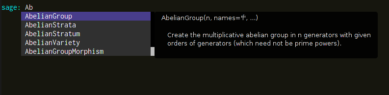
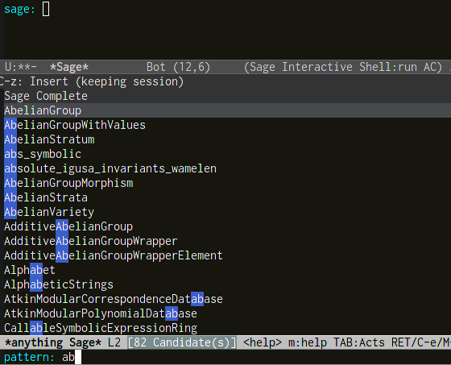
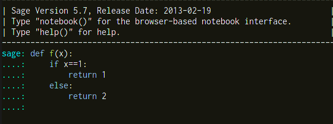

# Overview
sage-shell-mode is an Emacs front end for [Sage](http://www.sagemath.org/).

By sage-shell-mode, you can run Sage process in GNU Emacs and send
buffer contents or a file you edit to the process.
sage-shell-mode also provides sources for auto-complete and anything.

# Installation
You can install sage-shell-mode by elisp script or manually.
## Automatic Installation
To install sage-shell-mode, copy and paste
the following code in \*scratch\* buffer, evaluate it and follow the
instruction.  You can evaluate the elisp code in \*scratch\* buffer by
hitting C-j if the cursor is at the end of code.
By default,
sage-shell-mode will be installed in "~/.emacs.d/sage-shell". If you
want to change the installation directory, change the characters between
double quotes at the third line of the code.

```lisp
(progn
  (setq sage-install-url "https://raw.github.com/stakemori/sage-shell-mode/master/"
        sage-install-installation-directory "~/.emacs.d/sage-shell")
  (url-retrieve
   (concat sage-install-url "sage-install.el")
   (lambda (s)
     (goto-char (point-max))
     (eval-print-last-sexp))))
```

## Manual Installation
You can install sage-shell-mode manually as follows.

1. Clone the repository or download all files.

    ```sh
    git clone git://github.com/stakemori/sage-shell-mode.git
    cd sage-shell-mode
    ```

1. Copy elisp and python files.

    ```sh
    mkdir ~/.emacs.d/sage-shell
    cp *.el *.py ~/.emacs.d/sage-shell
    ```
1. Add the following lines to "~/.emacs", edit the last line and
evaluate the following code or restart Emacs.
If Sage executable is not in your PATH or Emacs cannot find it,
you have to specify the Sage root directory.

    ```lisp
    (add-to-list 'load-path "~/.emacs.d/sage-shell")
    (require 'sage-shell-autoloads)
    (add-to-list 'auto-mode-alist (cons "\\.sage$" 'sage-mode))
    ;; You do not need the following line if Sage executable is in your PATH.
    (setq sage-shell:sage-root "/path/to/SAGE_ROOT/")
    ```
1. Byte-compile elisp files.
1. (Optional) If you want to use auto-complete-mode in Sage buffers,
add the following lines to "~/.emacs". This requires `auto-complete.el`.

    ```lisp
    (setq ac-modes (append '(sage-mode sage-shell-mode) ac-modes))
    (add-hook 'sage-shell-mode-hook 'sage-shell-ac:add-sources)
    (add-hook 'sage-mode-hook 'sage-edit-ac:add-sources)
    ```

1. (Optional) If you want to complete Sage commands by anything,
add the following lines to "~/.emacs".
This requires `anything.el` and `anything-match-plugin.el`.

    ```lisp
    (setq sage-shell:completion-function
          'anything-sage-shell
          sage-shell:help-completion-function
          'anything-sage-shell-describe-object-at-point)
    ```

# Basic Usage
You can run Sage by `M-x run-sage`.
You can run new Sage process by `M-x run-new-sage`.
The major-mode of Sage process buffer is `sage-shell-mode`.

When you visit a file ended with ".sage", then `sage-mode` will be
the major-mode for the buffer. In `sage-mode`, type `C-c C-l` to load a
Sage script file. To view a Sage process buffer, type `C-x C-z`.


# Screenshots
Completion with auto-complete



Completion with anything



Automatic indentation and syntax highlighting work.


# License
Copyright &copy; 2013 Sho Takemori

Licensed under the [GPL Version 3][GPL]
[GPL]: http://www.gnu.org/licenses/gpl.html
